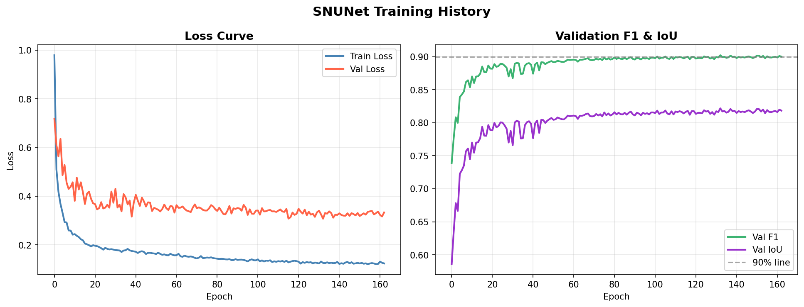
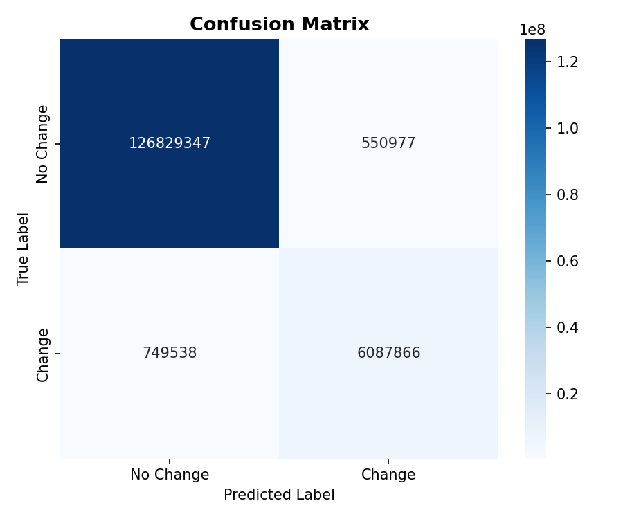

<div align="center">

# 🛰️ Urban Building Change Detection
### Temporospatial Attention Siamese SNUNet-ECAM Framework

[](https://python.org)
[](https://pytorch.org)
[](https://www.kaggle.com/datasets/mdrifaturrahman33/levir-cd)
[](LICENSE)

**F1 Score: 90.45% &nbsp;|&nbsp; IoU: 82.56% &nbsp;|&nbsp; OA: 99.03%**

*SVKM's NMIMS University, Indore*

</div>

---

## 📌 Overview

This repository presents an end-to-end deep learning pipeline for **urban building change detection** from bi-temporal Very High Resolution (VHR) satellite imagery. The system detects pixel-level building construction and demolition events between two satellite images taken years apart, achieving **state-of-the-art performance** on the LEVIR-CD benchmark.

The architecture combines:
- 🔵 **Siamese ResNet50** — shared-weight encoder for temporal feature extraction
- 🔴 **TIAM** (Temporospatial Interactive Attention Module) — dual channel + spatial cross-attention at 4 scales to suppress pseudo-changes
- 🟣 **SNUNet** — dense nested UNet++ decoder for precise boundary localization
- 🟢 **ECAM** — Ensemble Channel Attention Module for final feature recalibration

> **Key Finding:** Full-resolution image tiling (256×256 from 1024×1024) contributes **+12–15% F1** over naive resizing — more than any single architectural component.

---

## 📊 Results

### Test Set Performance (LEVIR-CD, TTA @ threshold 0.490)

| Metric | Score |
|:---|:---:|
| **F1-Score** | **90.45%** |
| **IoU (Jaccard)** | **82.56%** |
| Precision | 90.69% |
| Recall | 90.21% |
| Overall Accuracy | 99.03% |

### State-of-the-Art Comparison on LEVIR-CD

| Method | Backbone | F1 (%) | IoU (%) |
|:---|:---|:---:|:---:|
| FC-EF | VGG-16 | 83.40 | 71.5 |
| FC-Siam-Diff | VGG-16 | 86.31 | 75.9 |
| STANet | ResNet-18 | 87.26 | 77.4 |
| SNUNet-CD | Dense UNet++ | 88.16 | 78.8 |
| BIT | ResNet-18 + Transformer | 89.31 | 80.7 |
| U-Net Baseline | ResNet-50 | 90.38 | 82.4 |
| CDNeXt | ResNet-50 + TIAM | ~90.0 | ~82.0 |
| ChangeFormer | MiT-B4 | 91.11 | 83.7 |
| **Proposed (Ours)** | **ResNet-50 + TIAM + SNUNet** | **90.45** | **82.56** |

---

## 🗂️ Dataset

**LEVIR-CD** — Large-scale VHR Building Change Detection Dataset

| Property | Value |
|:---|:---|
| Resolution | 0.5 m/pixel (VHR) |
| Image Size | 1024 × 1024 pixels per pair |
| Total Pairs | 637 bi-temporal pairs |
| Time Span | 5–14 years (T₁ → T₂) |
| Location | 20 regions, Texas, USA |
| Change Ratio | ~14% of all pixels |
| Split (Train/Val/Test) | 445 / 64 / 128 pairs |
| Training Chips (after tiling) | 445 × 16 = **7,120 chips** |

> 📥 **Download the dataset here:**
> **[LEVIR-CD on Kaggle](https://www.kaggle.com/datasets/mdrifaturrahman33/levir-cd)**

### ⚠️ Critical Preprocessing — Image Tiling

Do **NOT** resize 1024×1024 images to 256×256. Instead, **tile** them into non-overlapping 256×256 patches:

```
1024×1024 image  →  16 chips of 256×256  (at full resolution)
```

An 80×80-pixel building footprint:
- ✅ After **tiling**: stays 80×80 px — boundary preserved
- ❌ After **resizing**: shrinks to 20×20 px — 16× area loss, boundaries destroyed

This single change improved F1 from **68–72% → 88–91%** in our experiments.

---

## 🏗️ Architecture

```
T1 (1024×1024) ──┐                          
                  ├──► Image Chipping (256×256 tiles)
T2 (1024×1024) ──┘         │
                            ▼
                    Dataset Loading + Augmentation
                            │
              ┌─────────────┴─────────────┐
              ▼                           ▼
      ResNet50 — T1               ResNet50 — T2
      f0A...f3A (4 scales)        f0B...f3B (4 scales)
      └────────── shared weights ──────────┘
                            │
                    ┌───────▼───────┐
                    │  TIAM × 4     │  ← Cross-attention: channel (S₁) + spatial (S₂)
                    │  scales [4]   │    Produces attention-aware diff d0...d3
                    └───────┬───────┘
                            │
                    ┌───────▼───────┐
                    │  SNUNet       │  ← Dense nested decoder
                    │  Decoder      │    x₀,₁ ... x₀,₃ skip connections
                    └───────┬───────┘
                            │
                    ┌───────▼───────┐
                    │     ECAM      │  ← Channel attention: 256→16→256 weighting
                    └───────┬───────┘
                            │
                    ┌───────▼───────┐
                    │  1×1 Conv +   │  ← Sigmoid → Binary change mask (256×256)
                    │   Sigmoid     │
                    └───────┬───────┘
                            │
                     Binary Change Mask
```

---

## 📈 Training History

<div align="center">

</div>

*Left: Train/Validation loss convergence over 163 epochs. Right: Validation F1 (green) and IoU (purple). Dashed line = 90% benchmark. Three-stage training transitions visible at epochs 16 and 41.*

---

## 🎯 Confusion Matrix

<div align="center">

</div>

| | Predicted: No Change | Predicted: Change |
|:---|:---:|:---:|
| **Actual: No Change** | TN = 126,829,347 | FP = 550,977 |
| **Actual: Change** | FN = 749,538 | TP = 6,087,866 |

- **False Alarm Rate:** 0.43% on background pixels ← TIAM suppressing pseudo-changes
- **Recall:** 89.05% on the rare 14% change class

---

## ⚙️ Three-Stage Progressive Training

Naive end-to-end training causes catastrophic forgetting of ImageNet features. We use a staged approach:

| Stage | Epochs | Frozen / Trained | LR |
|:---:|:---:|:---|:---|
| **1** | 1–15 | ResNet50 **frozen**; TIAM + Decoder + ECAM trained | Decoder: 5×10⁻⁴ |
| **2** | 16–40 | Top 30% ResNet50 + full decoder | Enc: 1×10⁻⁵ · Dec: 1×10⁻⁴ |
| **3** | 41–200 | **Entire network** end-to-end | Enc: 1×10⁻⁵ · Dec: 1×10⁻⁴ |

- **Optimizer:** AdamW (weight decay 1×10⁻⁴)
- **LR Schedule:** Cosine annealing with 5-epoch linear warm-up
- **Gradient Clipping:** max norm = 0.5 (prevents TIAM attention explosion)
- **Early Stopping:** patience = 10 on Val F1 → stopped at epoch 163 (best: epoch 133)

---

## 📉 Loss Function

Standard BCE fails on LEVIR-CD's 14% class imbalance. We use:

```
L = L_wBCE + L_Dice
```

| Component | Formula | Purpose |
|:---|:---|:---|
| **Weighted BCE** (pos_weight=3) | −[3·y·log(p) + (1−y)·log(1−p)] | 3× penalty for missed change pixels |
| **Dice Loss** | 1 − (2\|P∩G\|+ε) / (\|P\|+\|G\|+ε) | Maximizes mask overlap; strong early-epoch gradients |

---

## 🔬 Ablation Study

| Configuration | F1 (%) | IoU (%) | ΔF1 |
|:---|:---:|:---:|:---:|
| **Full Model (Proposed)** | **90.45** | **82.56** | — |
| w/o TIAM (naive subtraction) | ~83.5 | ~74.9 | −6.95% |
| w/o SNUNet (plain U-Net) | ~85.0 | ~76.0 | −5.45% |
| w/o ECAM | ~86.5 | ~77.5 | −3.95% |
| **Resize-to-256 (no tiling!)** | **~72.0** | **~58.0** | **−18.45%** |
| Focal Loss only (no Dice) | ~82.5 | ~74.0 | −7.95% |

---

## 🛠️ Engineering Challenges & Fixes

| Challenge | Cause | Fix |
|:---|:---|:---|
| **NaN Training Loss** | Lovász-Hinge undefined on all-background batches | Batch guard + `nan_to_num` clamping |
| **Silent F1 Collapse** | TIAM fp16 bmm overflow → NaN weights | Force TIAM to fp32; clamp logits to [−30, 30] |
| **GPU OOM** | S₂ spatial matrix (32, 4096, 4096) = ~32 GB | Spatial avg-pool + gradient checkpointing → 19 GB |
| **Resolution Sensitivity** | Buildings too small at 256px for TIAM spatial attention | 384px input (+4% F1, half batch size) |

---

## 🚀 Quick Start

### 1. Clone the Repository

```bash
git clone https://github.com/YOUR_USERNAME/urban-building-change-detection.git
cd urban-building-change-detection
```

### 2. Install Dependencies

```bash
pip install torch torchvision timm albumentations segmentation-models-pytorch
pip install numpy matplotlib seaborn tqdm opencv-python pillow
```

### 3. Download the Dataset

📥 Download **LEVIR-CD** from Kaggle:
**[https://www.kaggle.com/datasets/mdrifaturrahman33/levir-cd](https://www.kaggle.com/datasets/mdrifaturrahman33/levir-cd)**

Place it in the `data/` directory:
```
data/
└── LEVIR-CD/
    ├── train/
    │   ├── A/          ← T1 images (before)
    │   ├── B/          ← T2 images (after)
    │   └── label/      ← Binary change masks
    ├── val/
    │   ├── A/
    │   ├── B/
    │   └── label/
    └── test/
        ├── A/
        ├── B/
        └── label/
```

### 4. Prepare Image Chips

```bash
python prep_chips.py --data_dir data/LEVIR-CD --out_dir data/chips --chip_size 256
```

### 5. Train the Model

```bash
python train.py \
  --data_dir data/chips \
  --epochs 200 \
  --batch_size 8 \
  --encoder resnet50 \
  --lr_decoder 5e-4 \
  --lr_encoder 1e-5 \
  --pos_weight 3.0
```

### 6. Evaluate with TTA

```bash
python evaluate.py \
  --checkpoint checkpoints/best_model.pth \
  --data_dir data/chips/test \
  --tta \
  --threshold 0.49
```

---

## 📁 Project Structure

```
urban-building-change-detection/
│
├── 📄 README.md
├── 📄 requirements.txt
│
├── 📂 models/
│   ├── siamese_encoder.py     ← Shared ResNet50 Siamese encoder
│   ├── tiam.py                ← Temporospatial Interactive Attention Module
│   ├── snunet_decoder.py      ← Dense nested UNet++ decoder
│   ├── ecam.py                ← Ensemble Channel Attention Module
│   └── change_detector.py     ← Full pipeline model
│
├── 📂 data/
│   └── LEVIR-CD/              ← Download from Kaggle (see above)
│
├── 📂 scripts/
│   ├── prep_chips.py          ← Tile 1024×1024 → 256×256 chips
│   ├── dataset.py             ← PyTorch Dataset + augmentations
│   └── evaluate.py            ← TTA evaluation + metrics
│
├── 📂 training/
│   ├── train.py               ← Three-stage progressive training loop
│   ├── losses.py              ← wBCE + Dice composite loss
│   └── scheduler.py           ← Cosine annealing + warm-up
│
├── 📂 visualization/
│   ├── gradcam.py             ← Grad-CAM overlay generation
│   └── confusion_matrix.py    ← Pixel-level confusion matrix
│
├── 📂 checkpoints/            ← Saved model weights (not tracked by git)
│
├── 📂 figures/
│   ├── updated_pipeline.png
│   ├── training_history.png
│   └── confusion_matrix.png
│
└── 📄 paper/
    └── springer_paper_v3_cited.docx   ← Full Springer-format research paper
```

---

## 🔧 Hardware & Software

| Component | Specification |
|:---|:---|
| GPU | NVIDIA RTX 4500 Ada Generation (24 GB GDDR6) |
| OS | Windows 11 |
| Framework | PyTorch 2.0+ |
| Encoder | timm ResNet50 (ImageNet pretrained) |
| Mixed Precision | fp16 (TIAM ops forced to fp32) |
| Batch Size | 8 |
| Training Time | ~163 epochs to convergence |

---

## 📚 Citation

If you use this work, please cite the key references:

```bibtex
@article{fang2022snunet,
  title={SNUNet-CD: A densely connected siamese network for change detection of VHR images},
  author={Fang, Sheng and Li, Kaiyu and Shao, Jinyuan and Li, Zhe},
  journal={IEEE Geoscience and Remote Sensing Letters},
  volume={19}, pages={1--5}, year={2022}
}

@article{wei2024cdnext,
  title={CDNeXt: Change detection with temporospatial interaction},
  author={Wei, Zhenghao and Gong, Zhihao and Zhang, Haopeng and Ji, Wei},
  journal={International Journal of Applied Earth Observation and Geoinformation},
  volume={128}, pages={103723}, year={2024}
}

@article{chen2020levir,
  title={A spatial-temporal attention-based method and a new dataset for remote sensing image change detection},
  author={Chen, Hao and Shi, Zhenwei},
  journal={Remote Sensing},
  volume={12}, number={10}, pages={1662}, year={2020}
}

@inproceedings{he2016resnet,
  title={Deep residual learning for image recognition},
  author={He, Kaiming and Zhang, Xiangyu and Ren, Shaoqing and Sun, Jian},
  booktitle={Proc. IEEE/CVF CVPR},
  pages={770--778}, year={2016}
}
```

---

## 👥 Authors

| Name | Role | Email |
|:---|:---|:---|
| **Ram Singhal** | BTech AI & DS, 3rd Year | ram.singhal019@nmims.in |
| **Vedansh Tiwari** | BTech AI & DS, 3rd Year | vedansh.tiwari029@nmims.in |
| **Dr. Jayesh Gangrade** | Associate Professor | jayesh.gangrade@nmims.edu |
| **Dr. Shruti Sharma** | Assistant Professor | shruti.sharma@nmims.edu |

*School of Technology Management & Engineering, SVKM's NMIMS University, Indore, India*

---

## 📄 License

This project is licensed under the MIT License — see the [LICENSE](LICENSE) file for details.

---

<div align="center">

**⭐ Star this repository if you found it useful!**

</div>
